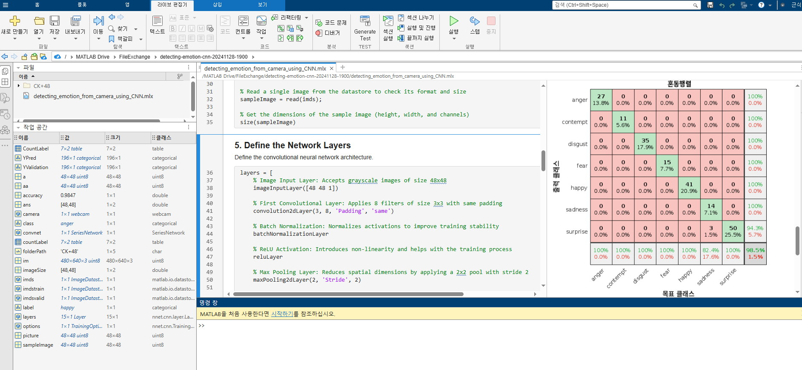
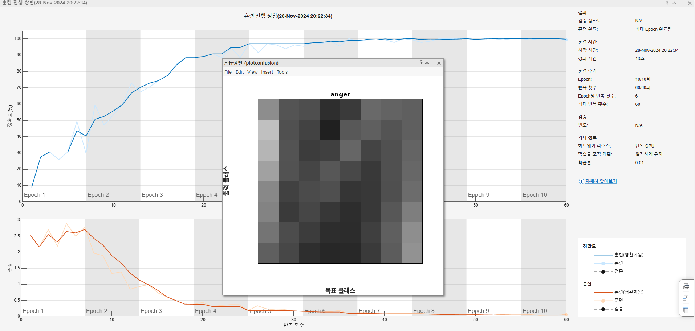
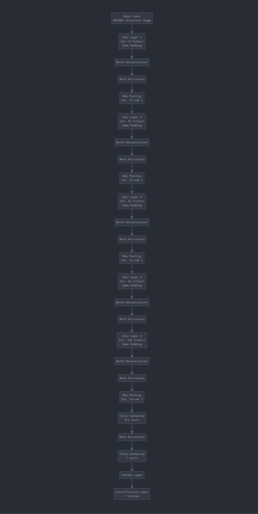

# README.md

[](https://kr.mathworks.com/matlabcentral/fileexchange/176528-real-time-emotion-recognition-from-usb-camera-with-deep-cnns)

## Real-Time Emotion Recognition from USB Camera with Deep CNNs

This repository contains MATLAB code for building and deploying a Convolutional Neural Network (CNN) to detect emotions from images. 
The workflow includes dataset preparation, model training, validation, and live camera integration for real-time emotion detection.

---

### Table of Contents
1. [Introduction](#introduction)
2. [Workflow Overview](#workflow-overview)
3. [Requirements](#requirements)
4. [Steps to Run](#steps-to-run)
5. [Key Sections](#key-sections)
6. [Live Camera Integration](#live-camera-integration)
7. [Output](#output)
8. [Acknowledgments](#acknowledgments)

---

### Introduction

This project leverages the CK+ dataset and a CNN model implemented in MATLAB to classify emotions into one of seven categories. The final model is capable of processing real-time images from a live camera feed to detect emotions.
## Screenshot 1: screenshot01.png


## Screenshot 2: screenshot02.png

---

### Workflow Overview

1. **Download Dataset**: Use the CK+ dataset available on Kaggle.
2. **Preprocessing**: Images are loaded into an `imageDatastore` for easy manipulation and split into training and validation sets.
3. **CNN Architecture**: A custom CNN is defined with convolutional, pooling, and fully connected layers.
4. **Training**: The model is trained using the Stochastic Gradient Descent with Momentum (SGDM) optimizer.
5. **Validation**: Accuracy and confusion matrix are used to evaluate the model's performance.
6. **Live Camera Integration**: The trained model is deployed to classify emotions from live webcam input.

---

### Requirements

1. MATLAB with the following toolboxes:
   - Deep Learning Toolbox
   - Computer Vision Toolbox
2. CK+ dataset from Kaggle:
   - [CK+ Dataset on Kaggle](https://www.kaggle.com/datasets/shawon10/ckplus)
3. (Fake) Webcam or IP Camera for real-time testing.

---

### Steps to Run

1. **Download and Set Up Dataset**:
   - Download the CK+ dataset from Kaggle and extract it to a folder named `CK+48`.

2. **Load Images**:
   - Update the `folderPath` variable in the MATLAB script with the correct path to the dataset.

3. **Train the Model**:
   - Run the script to preprocess the data and train the CNN.

4. **Validate the Model**:
   - Check the accuracy and confusion matrix using the validation dataset.

5. **Real-Time Detection**:
   - Use a connected (fake) webcam or IP camera for real-time emotion detection.

---

### Key Sections

#### 1. **Dataset Preparation**
- **Script**:
  ```matlab
  folderPath = 'CK+48';
  imds = imageDatastore(folderPath, 'IncludeSubfolders', true, 'LabelSource', 'foldernames');
  [imdstrain, imdsvalid] = splitEachLabel(imds, 0.8, 'randomize');
  ```

- The dataset is divided into training (80%) and validation (20%) subsets.

#### 2. **CNN Architecture**



I have created a flowchart to visualize the neural network architecture. Let me break down the key aspects of the diagram:

1. The network starts with an input layer of 48x48x1 grayscale images

2. It goes through 5 convolutional layers:

 * Progressively increasing number of filters (8 → 16 → 32 → 64 → 128)

 * Each layer uses 3x3 filters with same padding

 * Followed by batch normalization and ReLU activation

3. Max pooling layers (2x2 with stride 2) are used after some convolutional layers to reduce spatial dimensions

4. The final layers include:
A fully connected layer with 512 units
Another fully connected layer with 7 units
Softmax layer to convert to probabilities
Classification layer for the 7 classes

- **Key Features**:
  - Input layer for 48x48 grayscale images.
  - 5th convolutional layers with ReLU activation and max pooling.
  - Fully connected layer with seven output units for emotion classes.

- **Script**:
  ```matlab
  layers = [
      imageInputLayer([48 48 1])
      convolution2dLayer(3, 8, 'Padding', 'same')
      batchNormalizationLayer
      reluLayer
      maxPooling2dLayer(2, 'Stride', 2)
      ...
      fullyConnectedLayer(7)
      softmaxLayer
      classificationLayer];
  ```

#### 3. **Training the Model**
- **Options**:
  - Learning rate: 0.02
  - Maximum epochs: 20

- **Script**:
  ```matlab
  options = trainingOptions('sgdm', ...
      'InitialLearnRate', 0.02, ...
      'MaxEpochs', 20, ...
      'Shuffle', 'every-epoch', ...
      'ValidationFrequency', 10, ...
      'Verbose', false, ...
      'Plots', 'training-progress');
  convnet = trainNetwork(imdstrain, layers, options);
  ```

#### 4. **Validation**
- Evaluate the model with accuracy metrics and a confusion matrix:
  ```matlab
  YPred = classify(convnet, imdsvalid);
  YValidation = imdsvalid.Labels;
  accuracy = sum(YPred == YValidation) / numel(YValidation);
  plotconfusion(YValidation, YPred);
  ```

---

### USB Camera Integration

The trained model is used for real-time emotion detection using a USB webcam (or IP camera).
We will use a method that emulates a real USB camera to develop effectively. 
Pre-prepared image files will be used as input for the fake camera device file to capture frames. 
This method has been tested and reproduced on Ubuntu 22.04 and Ubuntu 24.04 versions. 
Detailed explanations and source code can be found in the [fake-usb-camera](fake-usb-camera) folder.

- **USB Webcam Example**:
  ```matlab
  camera = webcam(20);
  while true
      im = camera.snapshot;
      picture = rgb2gray(im);
      picture = imresize(picture, [48, 48]);
      label = classify(convnet, picture);
      image(im);
      title(char(label));
      drawnow;
  end
  ```

- **IP Camera Example**:
  ```matlab
  camera = ipcam('http://192.168.10.75:8080/video');
  ```

---

### Output

1. **Accuracy**: Displays the classification accuracy for the validation dataset.
2. **Confusion Matrix**: Provides a visual representation of model performance.
3. **Real-Time Predictions**: Displays live webcam feed with detected emotion as the title.


### DEMO 
* Play time: 2m 40seconds


---

### Acknowledgments

- CK+ dataset provided by Kaggle.
- [MATLAB 2024B](https://matlab.mathworks.com/) and its toolboxes for facilitating deep learning and computer vision.

--- 
